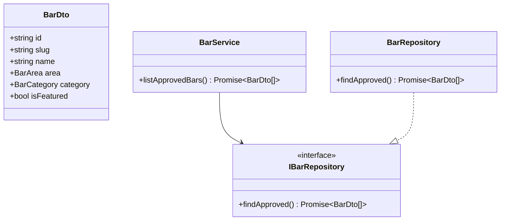

# UC001 — Design Class Diagram (DCD)

```mermaid
classDiagram
  class BarDto {
    +string id
    +string slug
    +string name
    +BarArea area
    +BarCategory category
    +bool isFeatured
  }

  class IBarRepository {
    <<interface>>
    +findApproved() Promise~BarDto[]~
  }

  class BarRepository {
    +findApproved() Promise~BarDto[]~
  }

  class BarService {
    +listApprovedBars() Promise~BarDto[]~
  }

  BarService --> IBarRepository
  BarRepository ..|> IBarRepository
```
