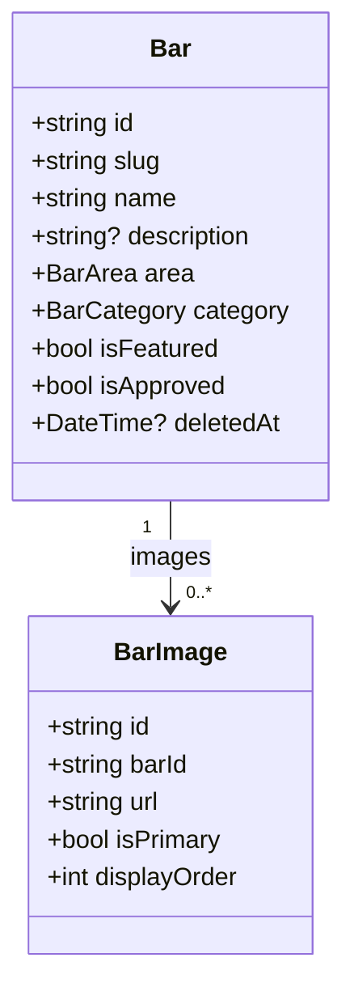

# UC001 — Domain Model (DM)

```mermaid
classDiagram
  class Bar {
    +string id
    +string slug
    +string name
    +string? description
    +BarArea area
    +BarCategory category
    +bool isFeatured
    +bool isApproved
    +DateTime? deletedAt
  }

  class BarImage {
    +string id
    +string barId
    +string url
    +bool isPrimary
    +int displayOrder
  }

  Bar "1" --> "0..*" BarImage : images
```
