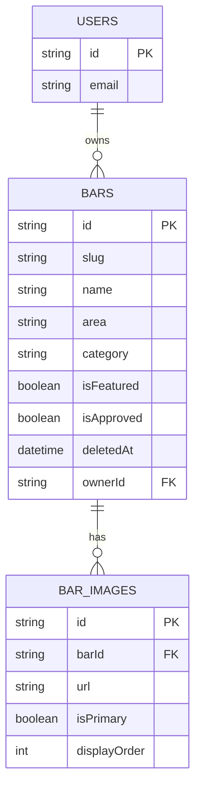

# UC001 — Entity Relationship Diagram (ERD)

```mermaid
erDiagram
  USERS ||--o{ BARS : owns
  BARS  ||--o{ BAR_IMAGES : has

  USERS {
    string id PK
    string email
  }

  BARS {
    string id PK
    string slug
    string name
    string area
    string category
    boolean isFeatured
    boolean isApproved
    datetime deletedAt
    string ownerId FK
  }

  BAR_IMAGES {
    string id PK
    string barId FK
    string url
    boolean isPrimary
    int displayOrder
  }
```
