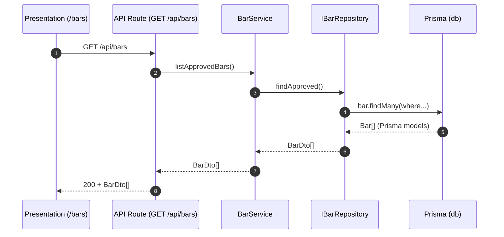

# UC001 — Sequence Diagram (SD)

```mermaid
sequenceDiagram
  autonumber
  participant UI as Presentation (/bars)
  participant API as API Route (GET /api/bars)
  participant SVC as BarService
  participant REPO as IBarRepository
  participant DB as Prisma (db)

  UI->>API: GET /api/bars
  API->>SVC: listApprovedBars()
  SVC->>REPO: findApproved()
  REPO->>DB: bar.findMany(where...)
  DB-->>REPO: Bar[] (Prisma models)
  REPO-->>SVC: BarDto[]
  SVC-->>API: BarDto[]
  API-->>UI: 200 + BarDto[]
```
