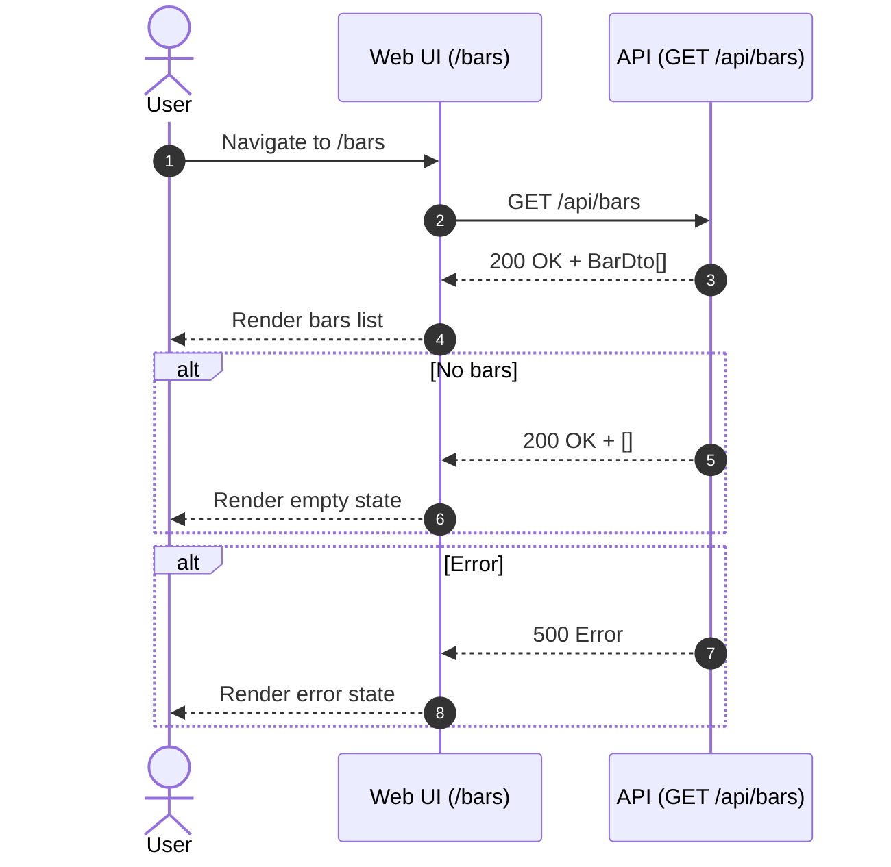

# UC001 — System Sequence Diagram (SSD)

```mermaid
sequenceDiagram
  autonumber
  actor User
  participant UI as Web UI (/bars)
  participant API as API (GET /api/bars)

  User->>UI: Navigate to /bars
  UI->>API: GET /api/bars
  API-->>UI: 200 OK + BarDto[]
  UI-->>User: Render bars list

  alt No bars
    API-->>UI: 200 OK + []
    UI-->>User: Render empty state
  end

  alt Error
    API-->>UI: 500 Error
    UI-->>User: Render error state
  end
```
