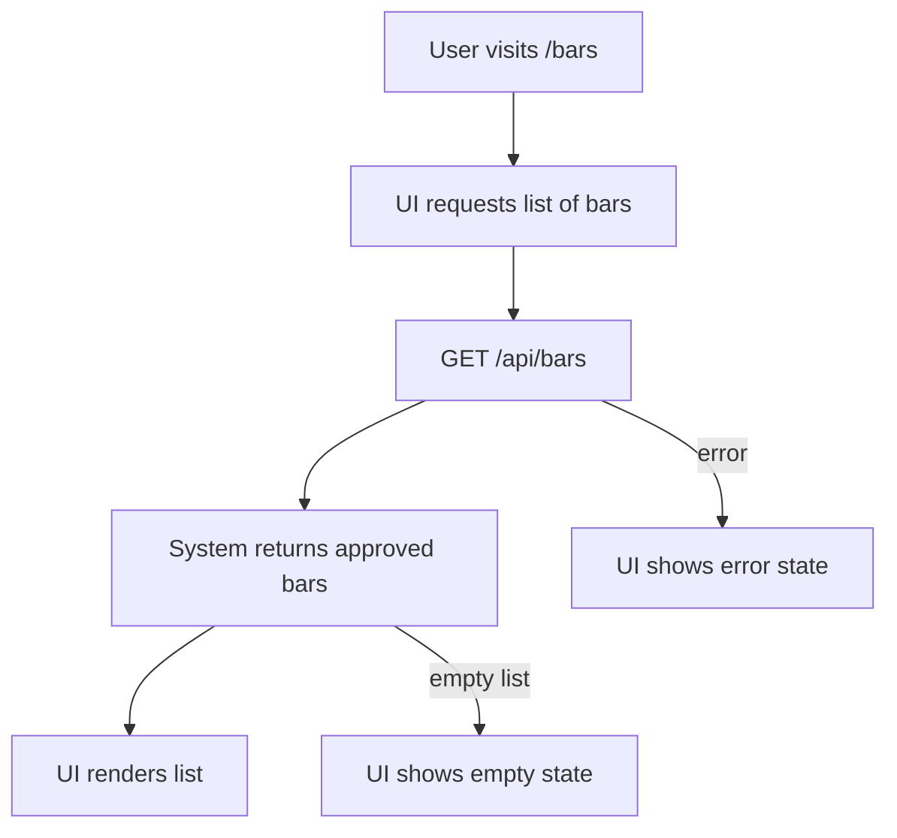

# UC001 — User Flow Diagram

```mermaid
flowchart TD
  A[User visits /bars] --> B[UI requests list of bars]
  B --> C[GET /api/bars]
  C --> D[System returns approved bars]
  D --> E[UI renders list]

  C -->|error| F[UI shows error state]
  D -->|empty list| G[UI shows empty state]
```
