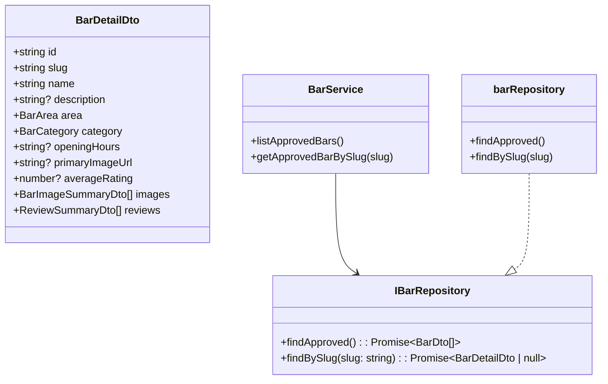

# UC002 — Design Class Diagram (DCD)

```mermaid
classDiagram
  class BarDetailDto {
    +string id
    +string slug
    +string name
    +string? description
    +BarArea area
    +BarCategory category
    +string? openingHours
    +string? primaryImageUrl
    +number? averageRating
    +BarImageSummaryDto[] images
    +ReviewSummaryDto[] reviews
  }

  class IBarRepository {
    +findApproved(): Promise~BarDto[]~
    +findBySlug(slug: string): Promise~BarDetailDto | null~
  }

  class barRepository {
    +findApproved()
    +findBySlug(slug)
  }

  class BarService {
    +listApprovedBars()
    +getApprovedBarBySlug(slug)
  }

  BarService --> IBarRepository
  barRepository ..|> IBarRepository
```
