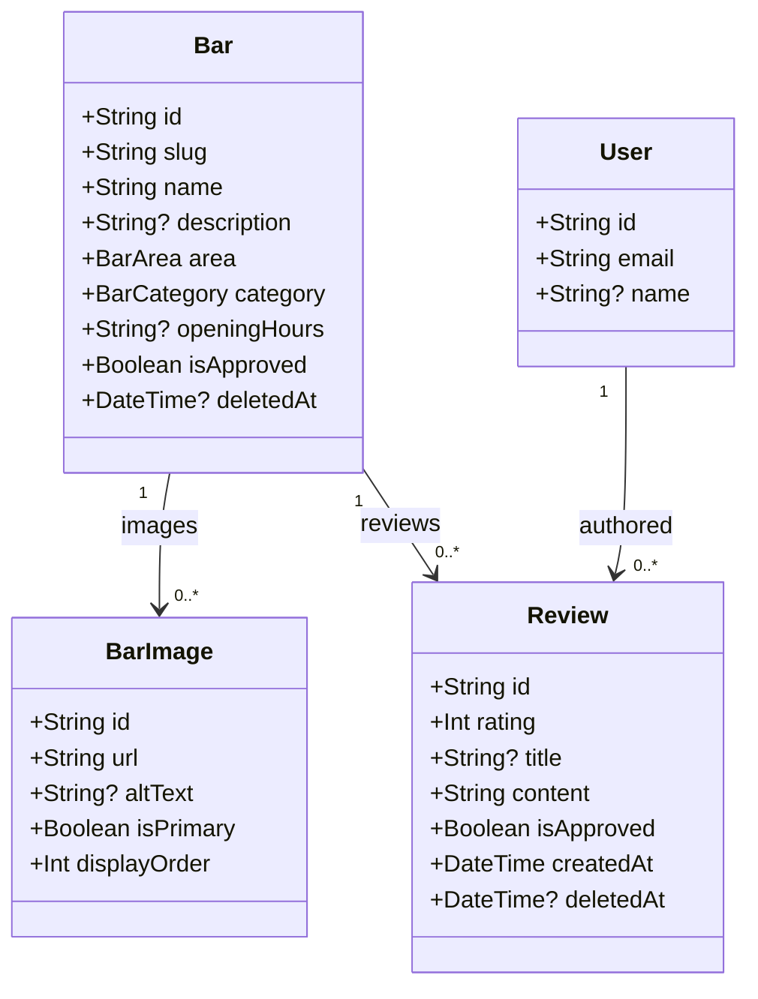

# UC002 — Domain Model (DM)

```mermaid
classDiagram
  class Bar {
    +String id
    +String slug
    +String name
    +String? description
    +BarArea area
    +BarCategory category
    +String? openingHours
    +Boolean isApproved
    +DateTime? deletedAt
  }

  class BarImage {
    +String id
    +String url
    +String? altText
    +Boolean isPrimary
    +Int displayOrder
  }

  class Review {
    +String id
    +Int rating
    +String? title
    +String content
    +Boolean isApproved
    +DateTime createdAt
    +DateTime? deletedAt
  }

  class User {
    +String id
    +String email
    +String? name
  }

  Bar "1" --> "0..*" BarImage : images
  Bar "1" --> "0..*" Review : reviews
  User "1" --> "0..*" Review : authored
```
