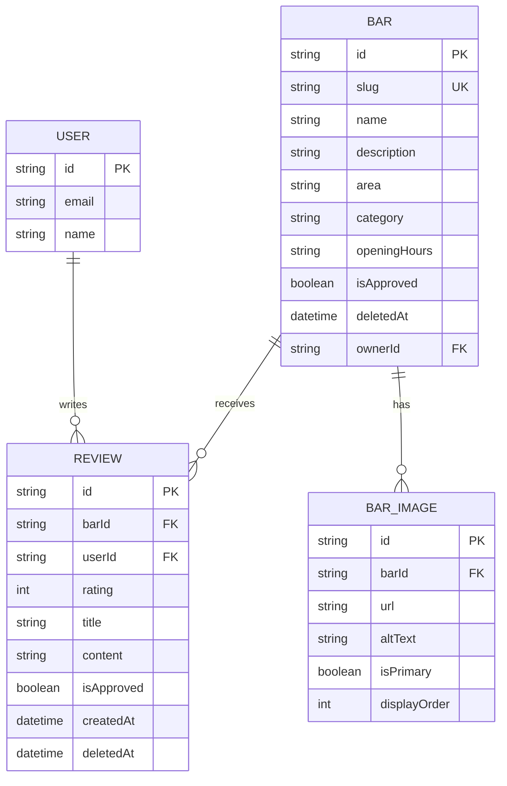

# UC002 — Entity Relationship Diagram (ERD)

```mermaid
erDiagram
  BAR {
    string id PK
    string slug UK
    string name
    string description
    string area
    string category
    string openingHours
    boolean isApproved
    datetime deletedAt
    string ownerId FK
  }

  BAR_IMAGE {
    string id PK
    string barId FK
    string url
    string altText
    boolean isPrimary
    int displayOrder
  }

  REVIEW {
    string id PK
    string barId FK
    string userId FK
    int rating
    string title
    string content
    boolean isApproved
    datetime createdAt
    datetime deletedAt
  }

  USER {
    string id PK
    string email
    string name
  }

  USER ||--o{ REVIEW : writes
  BAR ||--o{ REVIEW : receives
  BAR ||--o{ BAR_IMAGE : has
```
