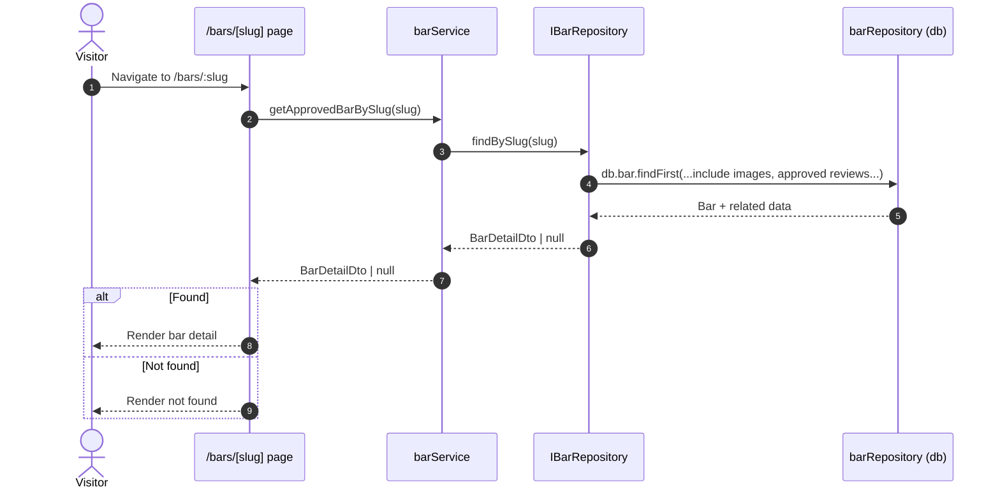

# UC002 — Sequence Diagram (SD)

```mermaid
sequenceDiagram
  autonumber
  actor Visitor
  participant Page as /bars/[slug] page
  participant Service as barService
  participant Repo as IBarRepository
  participant Prisma as barRepository (db)

  Visitor->>Page: Navigate to /bars/:slug
  Page->>Service: getApprovedBarBySlug(slug)
  Service->>Repo: findBySlug(slug)
  Repo->>Prisma: db.bar.findFirst(...include images, approved reviews...)
  Prisma-->>Repo: Bar + related data
  Repo-->>Service: BarDetailDto | null
  Service-->>Page: BarDetailDto | null

  alt Found
    Page-->>Visitor: Render bar detail
  else Not found
    Page-->>Visitor: Render not found
  end
```
