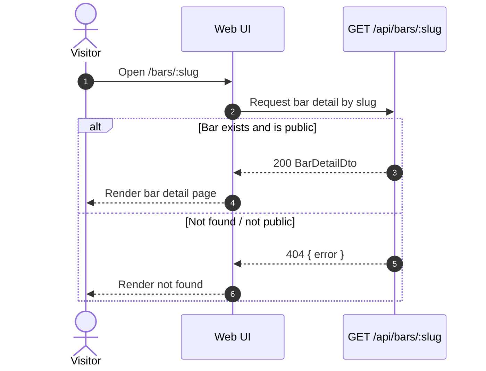

# UC002 — System Sequence Diagram (SSD)

```mermaid
sequenceDiagram
  autonumber
  actor Visitor
  participant UI as Web UI
  participant API as GET /api/bars/:slug

  Visitor->>UI: Open /bars/:slug
  UI->>API: Request bar detail by slug
  alt Bar exists and is public
    API-->>UI: 200 BarDetailDto
    UI-->>Visitor: Render bar detail page
  else Not found / not public
    API-->>UI: 404 { error }
    UI-->>Visitor: Render not found
  end
```
