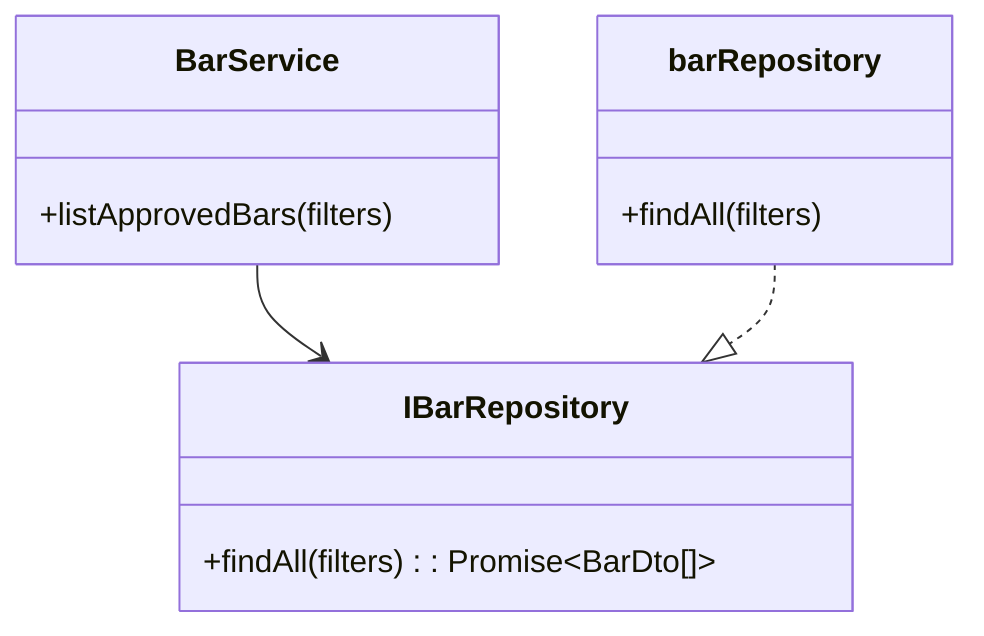

# UC003 — Design Class Diagram (DCD)

```mermaid
classDiagram
  class IBarRepository {
    +findAll(filters): Promise~BarDto[]~
  }

  class barRepository {
    +findAll(filters)
  }

  class BarService {
    +listApprovedBars(filters)
  }

  BarService --> IBarRepository
  barRepository ..|> IBarRepository
```
