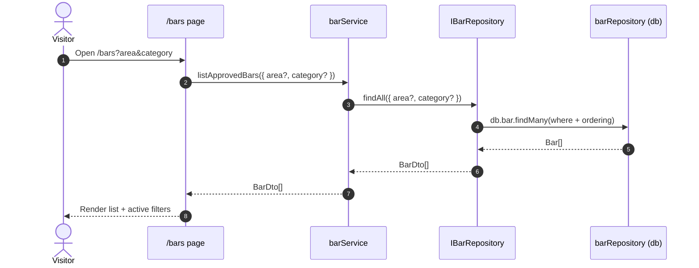

# UC003 — Sequence Diagram (SD)

```mermaid
sequenceDiagram
  autonumber
  actor Visitor
  participant Page as /bars page
  participant Service as barService
  participant Repo as IBarRepository
  participant Prisma as barRepository (db)

  Visitor->>Page: Open /bars?area&category
  Page->>Service: listApprovedBars({ area?, category? })
  Service->>Repo: findAll({ area?, category? })
  Repo->>Prisma: db.bar.findMany(where + ordering)
  Prisma-->>Repo: Bar[]
  Repo-->>Service: BarDto[]
  Service-->>Page: BarDto[]
  Page-->>Visitor: Render list + active filters
```
