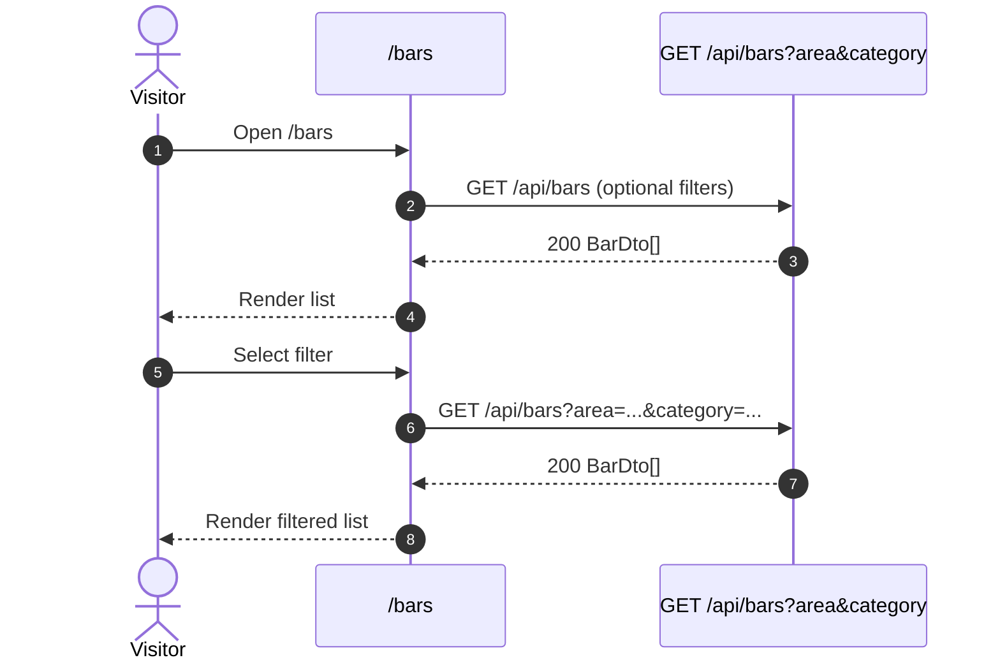

# UC003 — System Sequence Diagram (SSD)

```mermaid
sequenceDiagram
  autonumber
  actor Visitor
  participant UI as /bars
  participant API as GET /api/bars?area&category

  Visitor->>UI: Open /bars
  UI->>API: GET /api/bars (optional filters)
  API-->>UI: 200 BarDto[]
  UI-->>Visitor: Render list

  Visitor->>UI: Select filter
  UI->>API: GET /api/bars?area=...&category=...
  API-->>UI: 200 BarDto[]
  UI-->>Visitor: Render filtered list
```
