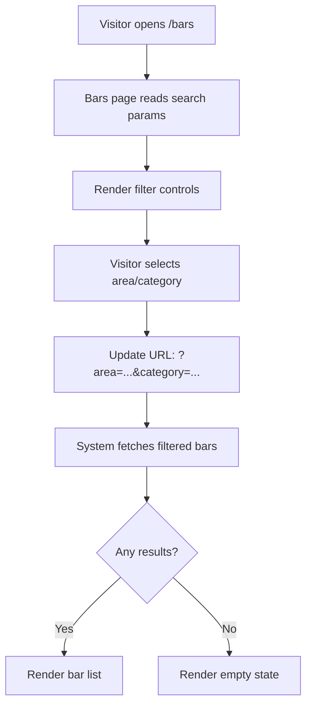

# UC003 — User Flow Diagram

```mermaid
flowchart TD
  A[Visitor opens /bars] --> B[Bars page reads search params]
  B --> C[Render filter controls]
  C --> D[Visitor selects area/category]
  D --> E[Update URL: ?area=...&category=...]
  E --> F[System fetches filtered bars]
  F --> G{Any results?}
  G -->|Yes| H[Render bar list]
  G -->|No| I[Render empty state]
```
