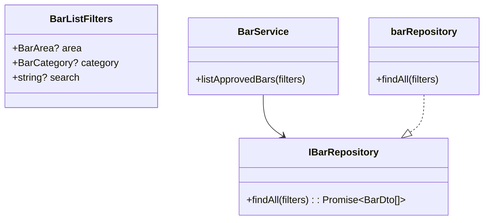

# UC004 — Design Class Diagram (DCD)

```mermaid
classDiagram
  class BarListFilters {
    +BarArea? area
    +BarCategory? category
    +string? search
  }

  class IBarRepository {
    +findAll(filters): Promise~BarDto[]~
  }

  class barRepository {
    +findAll(filters)
  }

  class BarService {
    +listApprovedBars(filters)
  }

  BarService --> IBarRepository
  barRepository ..|> IBarRepository
```
