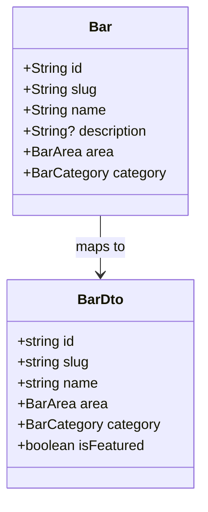

# UC004 — Domain Model (DM)

```mermaid
classDiagram
  class Bar {
    +String id
    +String slug
    +String name
    +String? description
    +BarArea area
    +BarCategory category
  }

  class BarDto {
    +string id
    +string slug
    +string name
    +BarArea area
    +BarCategory category
    +boolean isFeatured
  }

  Bar --> BarDto : maps to
```
