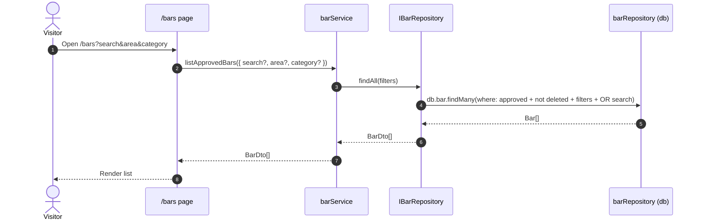

# UC004 — Sequence Diagram (SD)

```mermaid
sequenceDiagram
  autonumber
  actor Visitor
  participant Page as /bars page
  participant Service as barService
  participant Repo as IBarRepository
  participant Prisma as barRepository (db)

  Visitor->>Page: Open /bars?search&area&category
  Page->>Service: listApprovedBars({ search?, area?, category? })
  Service->>Repo: findAll(filters)
  Repo->>Prisma: db.bar.findMany(where: approved + not deleted + filters + OR search)
  Prisma-->>Repo: Bar[]
  Repo-->>Service: BarDto[]
  Service-->>Page: BarDto[]
  Page-->>Visitor: Render list
```
