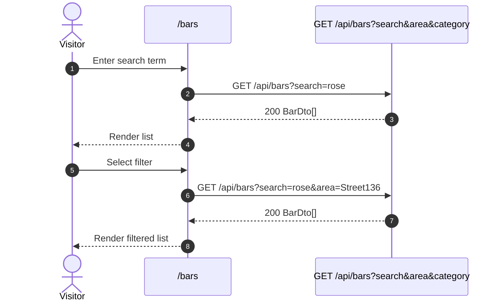

# UC004 — System Sequence Diagram (SSD)

```mermaid
sequenceDiagram
  autonumber
  actor Visitor
  participant UI as /bars
  participant API as GET /api/bars?search&area&category

  Visitor->>UI: Enter search term
  UI->>API: GET /api/bars?search=rose
  API-->>UI: 200 BarDto[]
  UI-->>Visitor: Render list

  Visitor->>UI: Select filter
  UI->>API: GET /api/bars?search=rose&area=Street136
  API-->>UI: 200 BarDto[]
  UI-->>Visitor: Render filtered list
```
