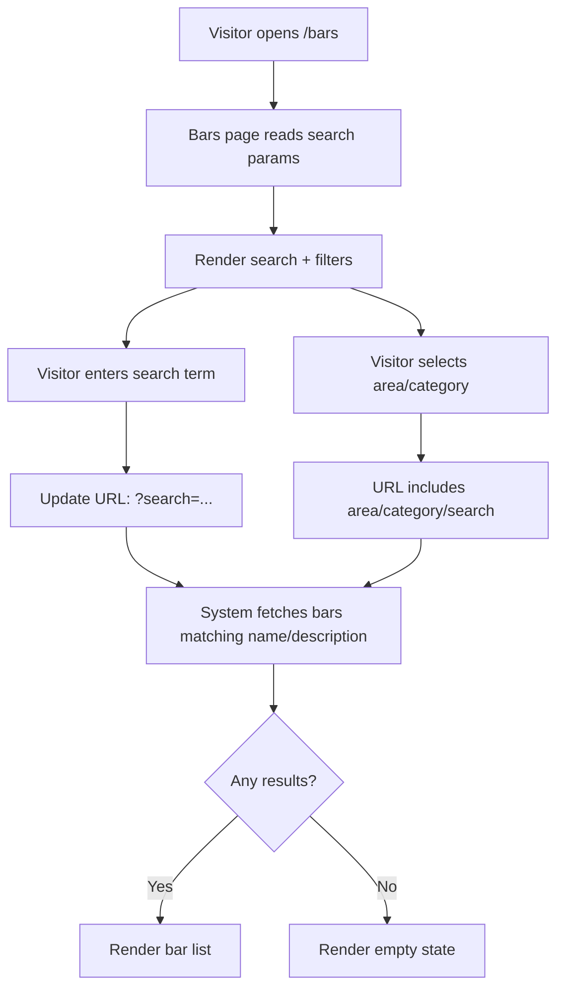

# UC004 — User Flow Diagram

```mermaid
flowchart TD
  A[Visitor opens /bars] --> B[Bars page reads search params]
  B --> C[Render search + filters]
  C --> D[Visitor enters search term]
  D --> E[Update URL: ?search=...]
  E --> F[System fetches bars matching name/description]
  F --> G{Any results?}
  G -->|Yes| H[Render bar list]
  G -->|No| I[Render empty state]

  C --> J[Visitor selects area/category]
  J --> K[URL includes area/category/search]
  K --> F
```
