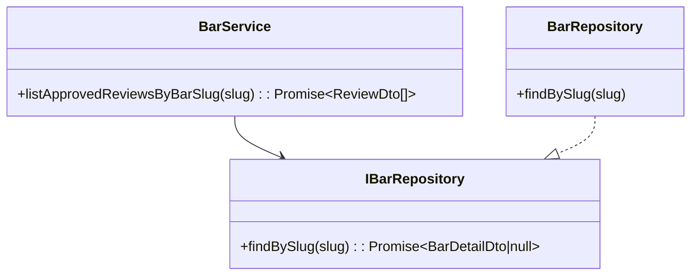

# UC005 — Design Class Diagram

```mermaid
classDiagram
  class BarService {
    +listApprovedReviewsByBarSlug(slug): Promise~ReviewDto[]~
  }

  class IBarRepository {
    +findBySlug(slug): Promise~BarDetailDto|null~
  }

  class BarRepository {
    +findBySlug(slug)
  }

  BarService --> IBarRepository
  BarRepository ..|> IBarRepository
```
