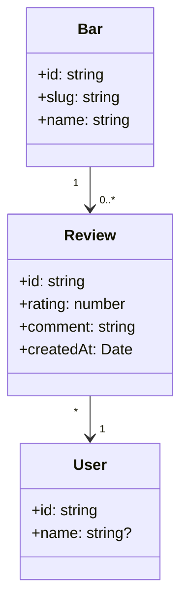

# UC005 — Domain Model

```mermaid
classDiagram
  class Bar {
    +id: string
    +slug: string
    +name: string
  }

  class Review {
    +id: string
    +rating: number
    +comment: string
    +createdAt: Date
  }

  class User {
    +id: string
    +name: string?
  }

  Bar "1" --> "0..*" Review
  Review "*" --> "1" User
```
