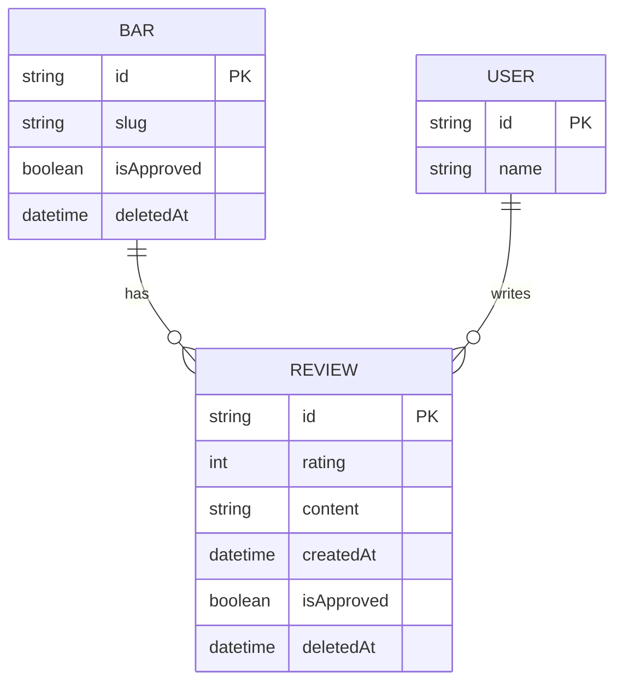

# UC005 — ERD

```mermaid
erDiagram
  BAR ||--o{ REVIEW : has
  USER ||--o{ REVIEW : writes

  BAR {
    string id PK
    string slug
    boolean isApproved
    datetime deletedAt
  }

  REVIEW {
    string id PK
    int rating
    string content
    datetime createdAt
    boolean isApproved
    datetime deletedAt
  }

  USER {
    string id PK
    string name
  }
```
