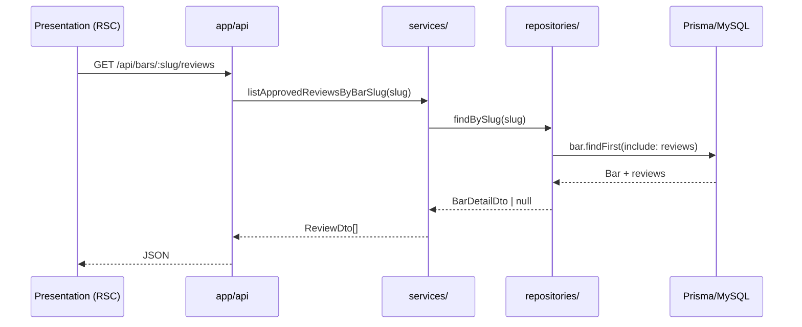

# UC005 — Sequence Diagram (Layered)

```mermaid
sequenceDiagram
  participant UI as Presentation (RSC)
  participant API as app/api
  participant Svc as services/
  participant Repo as repositories/
  participant DB as Prisma/MySQL

  UI->>API: GET /api/bars/:slug/reviews
  API->>Svc: listApprovedReviewsByBarSlug(slug)
  Svc->>Repo: findBySlug(slug)
  Repo->>DB: bar.findFirst(include: reviews)
  DB-->>Repo: Bar + reviews
  Repo-->>Svc: BarDetailDto | null
  Svc-->>API: ReviewDto[]
  API-->>UI: JSON
```
