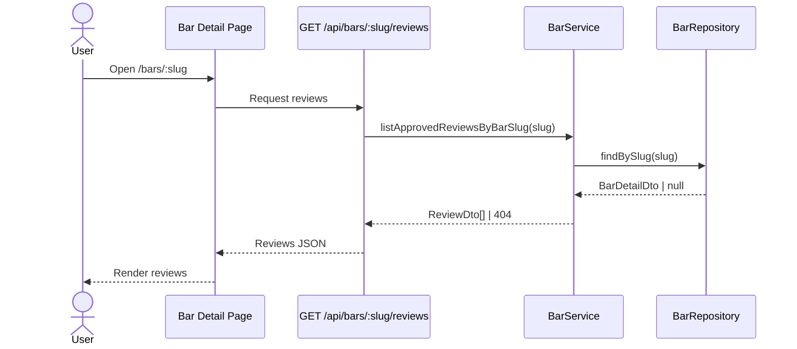

# UC005 — System Sequence Diagram

```mermaid
sequenceDiagram
  actor User
  participant UI as Bar Detail Page
  participant API as GET /api/bars/:slug/reviews
  participant Svc as BarService
  participant Repo as BarRepository

  User->>UI: Open /bars/:slug
  UI->>API: Request reviews
  API->>Svc: listApprovedReviewsByBarSlug(slug)
  Svc->>Repo: findBySlug(slug)
  Repo-->>Svc: BarDetailDto | null
  Svc-->>API: ReviewDto[] | 404
  API-->>UI: Reviews JSON
  UI-->>User: Render reviews
```
