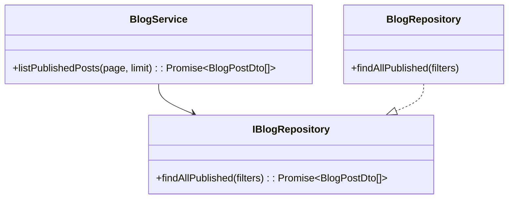

# UC006 — Design Class Diagram

```mermaid
classDiagram
  class BlogService {
    +listPublishedPosts(page, limit): Promise~BlogPostDto[]~
  }

  class IBlogRepository {
    +findAllPublished(filters): Promise~BlogPostDto[]~
  }

  class BlogRepository {
    +findAllPublished(filters)
  }

  BlogService --> IBlogRepository
  BlogRepository ..|> IBlogRepository
```
