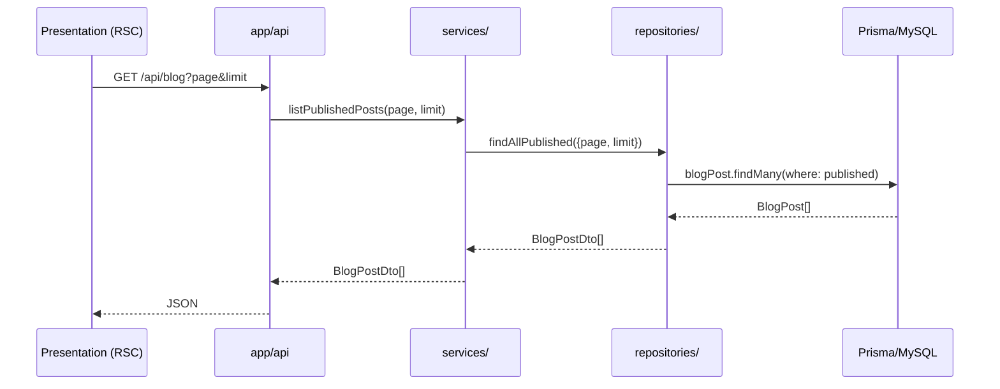

# UC006 — Sequence Diagram (Layered)

```mermaid
sequenceDiagram
  participant UI as Presentation (RSC)
  participant API as app/api
  participant Svc as services/
  participant Repo as repositories/
  participant DB as Prisma/MySQL

  UI->>API: GET /api/blog?page&limit
  API->>Svc: listPublishedPosts(page, limit)
  Svc->>Repo: findAllPublished({page, limit})
  Repo->>DB: blogPost.findMany(where: published)
  DB-->>Repo: BlogPost[]
  Repo-->>Svc: BlogPostDto[]
  Svc-->>API: BlogPostDto[]
  API-->>UI: JSON
```
