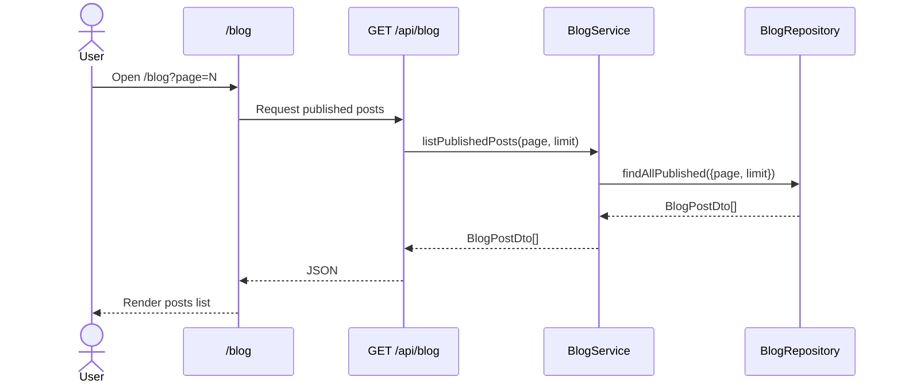

# UC006 — System Sequence Diagram

```mermaid
sequenceDiagram
  actor User
  participant UI as /blog
  participant API as GET /api/blog
  participant Svc as BlogService
  participant Repo as BlogRepository

  User->>UI: Open /blog?page=N
  UI->>API: Request published posts
  API->>Svc: listPublishedPosts(page, limit)
  Svc->>Repo: findAllPublished({page, limit})
  Repo-->>Svc: BlogPostDto[]
  Svc-->>API: BlogPostDto[]
  API-->>UI: JSON
  UI-->>User: Render posts list
```
