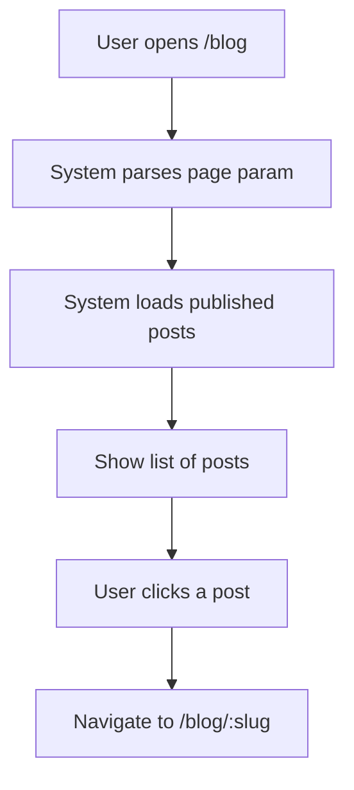

# UC006 — User Flow Diagram

```mermaid
flowchart TD
  A[User opens /blog] --> B[System parses page param]
  B --> C[System loads published posts]
  C --> D[Show list of posts]
  D --> E[User clicks a post]
  E --> F[Navigate to /blog/:slug]
```
