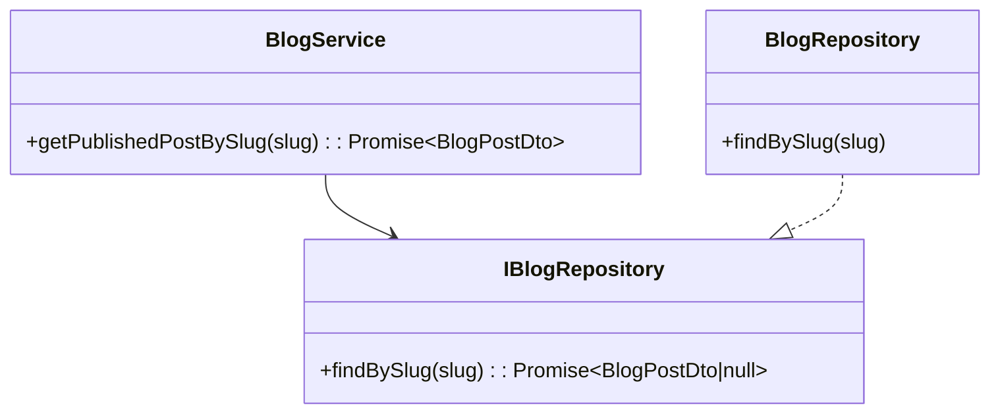

# UC007 — Design Class Diagram

```mermaid
classDiagram
  class BlogService {
    +getPublishedPostBySlug(slug): Promise~BlogPostDto~
  }

  class IBlogRepository {
    +findBySlug(slug): Promise~BlogPostDto|null~
  }

  class BlogRepository {
    +findBySlug(slug)
  }

  BlogService --> IBlogRepository
  BlogRepository ..|> IBlogRepository
```
