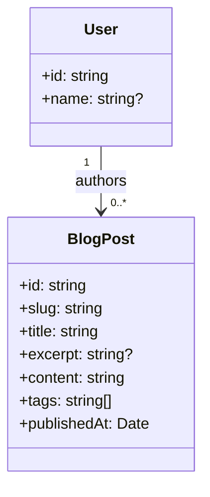

# UC007 — Domain Model

```mermaid
classDiagram
  class BlogPost {
    +id: string
    +slug: string
    +title: string
    +excerpt: string?
    +content: string
    +tags: string[]
    +publishedAt: Date
  }

  class User {
    +id: string
    +name: string?
  }

  User "1" --> "0..*" BlogPost : authors
```
