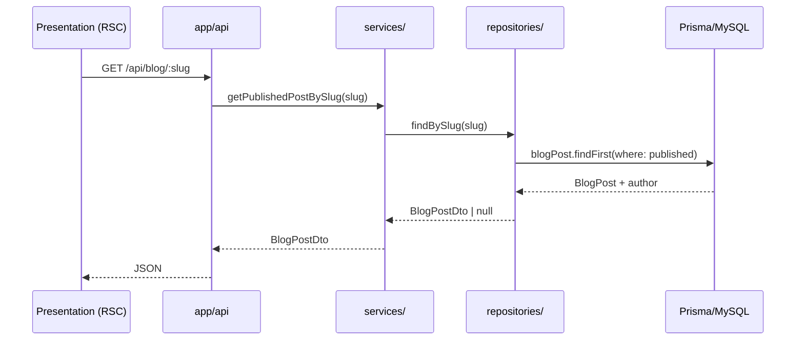

# UC007 — Sequence Diagram (Layered)

```mermaid
sequenceDiagram
  participant UI as Presentation (RSC)
  participant API as app/api
  participant Svc as services/
  participant Repo as repositories/
  participant DB as Prisma/MySQL

  UI->>API: GET /api/blog/:slug
  API->>Svc: getPublishedPostBySlug(slug)
  Svc->>Repo: findBySlug(slug)
  Repo->>DB: blogPost.findFirst(where: published)
  DB-->>Repo: BlogPost + author
  Repo-->>Svc: BlogPostDto | null
  Svc-->>API: BlogPostDto
  API-->>UI: JSON
```
