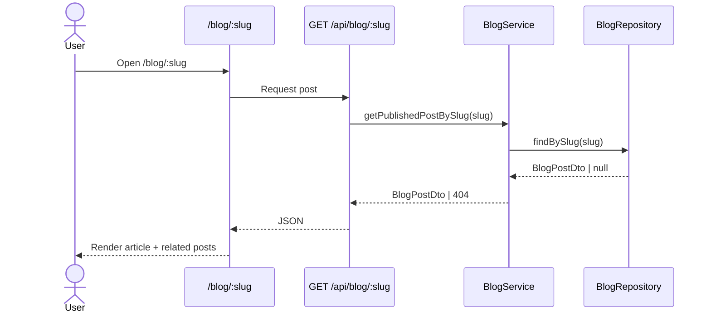

# UC007 — System Sequence Diagram

```mermaid
sequenceDiagram
  actor User
  participant UI as /blog/:slug
  participant API as GET /api/blog/:slug
  participant Svc as BlogService
  participant Repo as BlogRepository

  User->>UI: Open /blog/:slug
  UI->>API: Request post
  API->>Svc: getPublishedPostBySlug(slug)
  Svc->>Repo: findBySlug(slug)
  Repo-->>Svc: BlogPostDto | null
  Svc-->>API: BlogPostDto | 404
  API-->>UI: JSON
  UI-->>User: Render article + related posts
```
