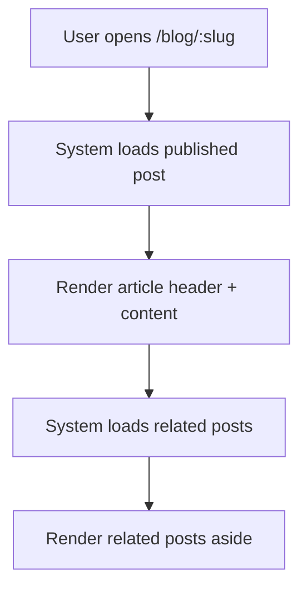

# UC007 — User Flow Diagram

```mermaid
flowchart TD
  A[User opens /blog/:slug] --> B[System loads published post]
  B --> C[Render article header + content]
  C --> D[System loads related posts]
  D --> E[Render related posts aside]
```
