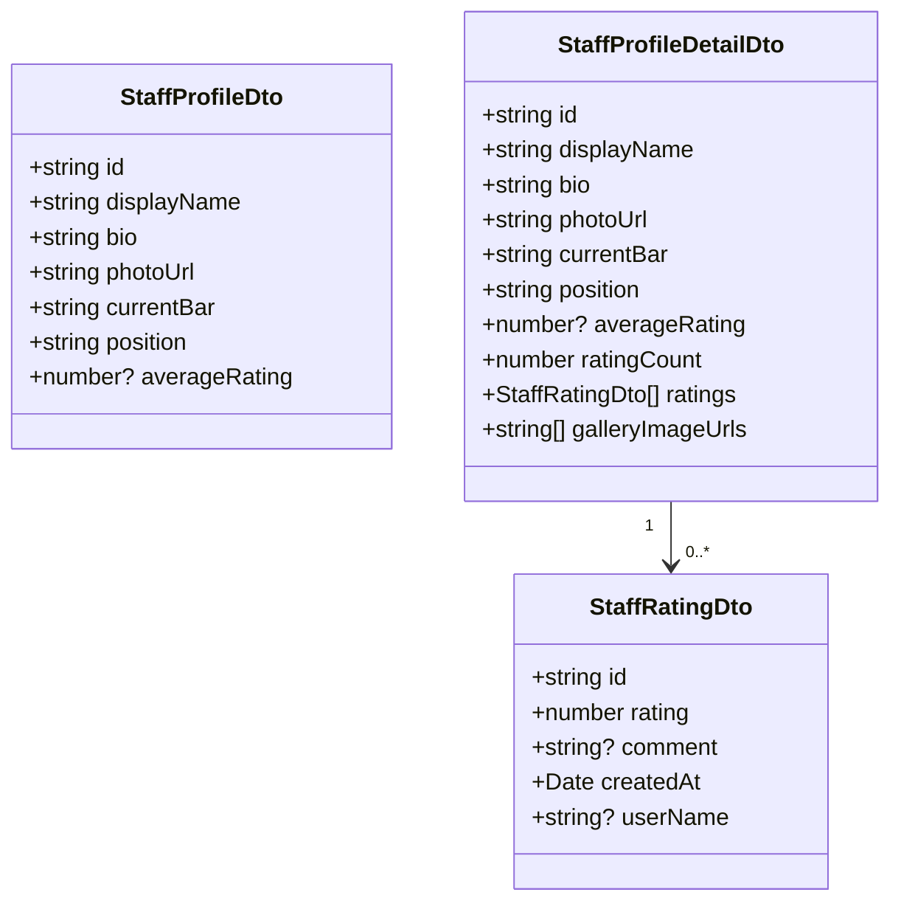

# UC008 — Design Class Diagram (DCD)

```mermaid
classDiagram
  class StaffProfileDto {
    +string id
    +string displayName
    +string bio
    +string photoUrl
    +string currentBar
    +string position
    +number? averageRating
  }

  class StaffRatingDto {
    +string id
    +number rating
    +string? comment
    +Date createdAt
    +string? userName
  }

  class StaffProfileDetailDto {
    +string id
    +string displayName
    +string bio
    +string photoUrl
    +string currentBar
    +string position
    +number? averageRating
    +number ratingCount
    +StaffRatingDto[] ratings
    +string[] galleryImageUrls
  }

  StaffProfileDetailDto "1" --> "0..*" StaffRatingDto
```
