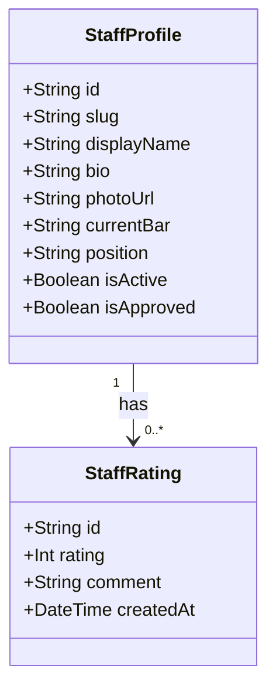

# UC008 — Domain Model (DM)

```mermaid
classDiagram
  class StaffProfile {
    +String id
    +String slug
    +String displayName
    +String bio
    +String photoUrl
    +String currentBar
    +String position
    +Boolean isActive
    +Boolean isApproved
  }

  class StaffRating {
    +String id
    +Int rating
    +String comment
    +DateTime createdAt
  }

  StaffProfile "1" --> "0..*" StaffRating : has
```
