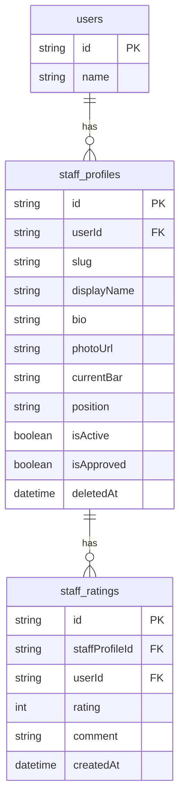

# UC008 — Entity Relationship Diagram (ERD)

```mermaid
erDiagram
  users ||--o{ staff_profiles : has
  staff_profiles ||--o{ staff_ratings : has

  users {
    string id PK
    string name
  }

  staff_profiles {
    string id PK
    string userId FK
    string slug
    string displayName
    string bio
    string photoUrl
    string currentBar
    string position
    boolean isActive
    boolean isApproved
    datetime deletedAt
  }

  staff_ratings {
    string id PK
    string staffProfileId FK
    string userId FK
    int rating
    string comment
    datetime createdAt
  }
```
