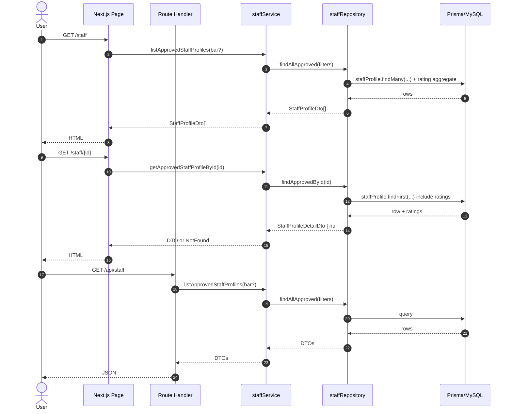

# UC008 — Sequence Diagram (SD)

```mermaid
sequenceDiagram
  autonumber
  actor User
  participant Page as Next.js Page
  participant API as Route Handler
  participant Service as staffService
  participant Repo as staffRepository
  participant DB as Prisma/MySQL

  User->>Page: GET /staff
  Page->>Service: listApprovedStaffProfiles(bar?)
  Service->>Repo: findAllApproved(filters)
  Repo->>DB: staffProfile.findMany(...) + rating aggregate
  DB-->>Repo: rows
  Repo-->>Service: StaffProfileDto[]
  Service-->>Page: StaffProfileDto[]
  Page-->>User: HTML

  User->>Page: GET /staff/{id}
  Page->>Service: getApprovedStaffProfileById(id)
  Service->>Repo: findApprovedById(id)
  Repo->>DB: staffProfile.findFirst(...) include ratings
  DB-->>Repo: row + ratings
  Repo-->>Service: StaffProfileDetailDto | null
  Service-->>Page: DTO or NotFound
  Page-->>User: HTML

  User->>API: GET /api/staff
  API->>Service: listApprovedStaffProfiles(bar?)
  Service->>Repo: findAllApproved(filters)
  Repo->>DB: query
  DB-->>Repo: rows
  Repo-->>Service: DTOs
  Service-->>API: DTOs
  API-->>User: JSON
```
