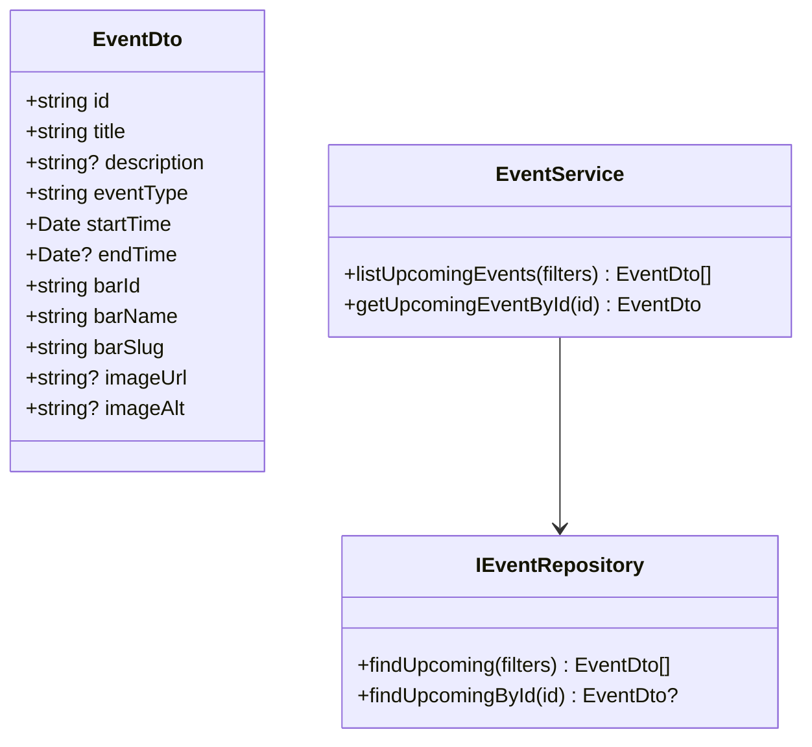

# UC009 — Design Class Diagram (DCD)

```mermaid
classDiagram
  class EventDto {
    +string id
    +string title
    +string? description
    +string eventType
    +Date startTime
    +Date? endTime
    +string barId
    +string barName
    +string barSlug
    +string? imageUrl
    +string? imageAlt
  }

  class IEventRepository {
    +findUpcoming(filters) EventDto[]
    +findUpcomingById(id) EventDto?
  }

  class EventService {
    +listUpcomingEvents(filters) EventDto[]
    +getUpcomingEventById(id) EventDto
  }

  EventService --> IEventRepository
```
