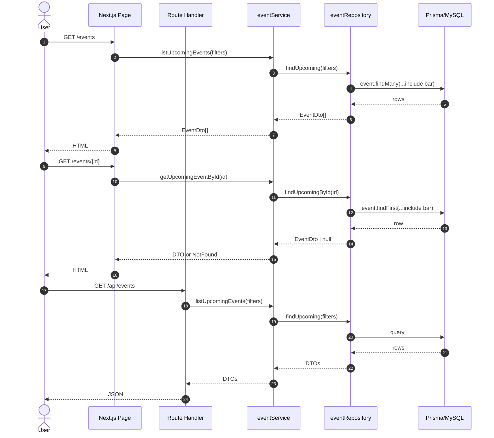

# UC009 — Sequence Diagram (SD)

```mermaid
sequenceDiagram
  autonumber
  actor User
  participant Page as Next.js Page
  participant API as Route Handler
  participant Service as eventService
  participant Repo as eventRepository
  participant DB as Prisma/MySQL

  User->>Page: GET /events
  Page->>Service: listUpcomingEvents(filters)
  Service->>Repo: findUpcoming(filters)
  Repo->>DB: event.findMany(...include bar)
  DB-->>Repo: rows
  Repo-->>Service: EventDto[]
  Service-->>Page: EventDto[]
  Page-->>User: HTML

  User->>Page: GET /events/{id}
  Page->>Service: getUpcomingEventById(id)
  Service->>Repo: findUpcomingById(id)
  Repo->>DB: event.findFirst(...include bar)
  DB-->>Repo: row
  Repo-->>Service: EventDto | null
  Service-->>Page: DTO or NotFound
  Page-->>User: HTML

  User->>API: GET /api/events
  API->>Service: listUpcomingEvents(filters)
  Service->>Repo: findUpcoming(filters)
  Repo->>DB: query
  DB-->>Repo: rows
  Repo-->>Service: DTOs
  Service-->>API: DTOs
  API-->>User: JSON
```
