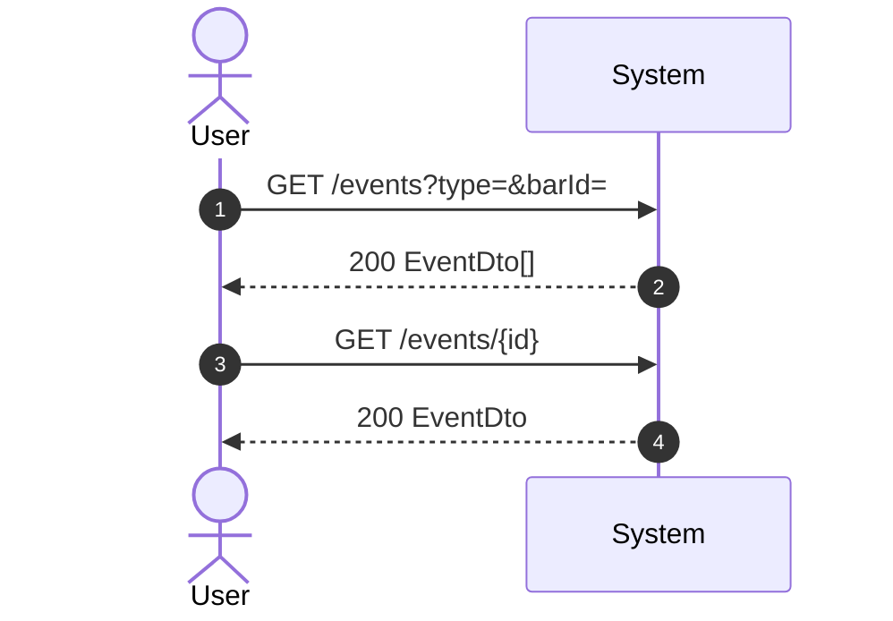

# UC009 — System Sequence Diagram (SSD)

```mermaid
sequenceDiagram
  autonumber
  actor User
  participant System

  User->>System: GET /events?type=&barId=
  System-->>User: 200 EventDto[]

  User->>System: GET /events/{id}
  System-->>User: 200 EventDto
```
