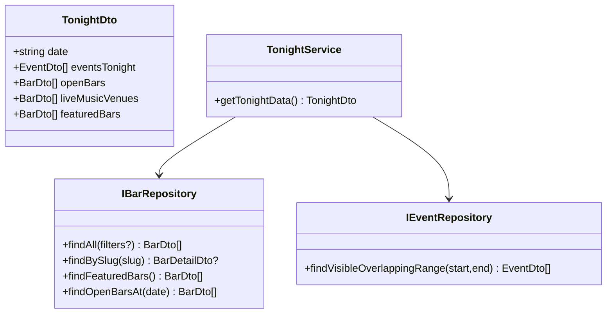

# UC010 — Design Class Diagram (DCD)

```mermaid
classDiagram
  class TonightDto {
    +string date
    +EventDto[] eventsTonight
    +BarDto[] openBars
    +BarDto[] liveMusicVenues
    +BarDto[] featuredBars
  }

  class IBarRepository {
    +findAll(filters?) BarDto[]
    +findBySlug(slug) BarDetailDto?
    +findFeaturedBars() BarDto[]
    +findOpenBarsAt(date) BarDto[]
  }

  class IEventRepository {
    +findVisibleOverlappingRange(start,end) EventDto[]
  }

  class TonightService {
    +getTonightData() TonightDto
  }

  TonightService --> IBarRepository
  TonightService --> IEventRepository
```
