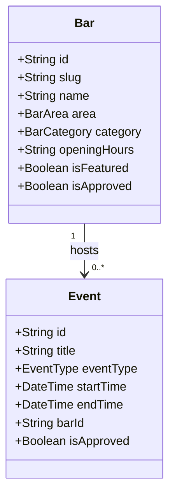

# UC010 — Domain Model (DM)

```mermaid
classDiagram
  class Bar {
    +String id
    +String slug
    +String name
    +BarArea area
    +BarCategory category
    +String openingHours
    +Boolean isFeatured
    +Boolean isApproved
  }

  class Event {
    +String id
    +String title
    +EventType eventType
    +DateTime startTime
    +DateTime endTime
    +String barId
    +Boolean isApproved
  }

  Bar "1" --> "0..*" Event : hosts
```
