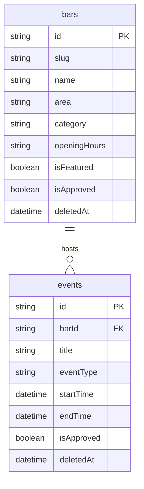

# UC010 — Entity Relationship Diagram (ERD)

```mermaid
erDiagram
  bars ||--o{ events : hosts

  bars {
    string id PK
    string slug
    string name
    string area
    string category
    string openingHours
    boolean isFeatured
    boolean isApproved
    datetime deletedAt
  }

  events {
    string id PK
    string barId FK
    string title
    string eventType
    datetime startTime
    datetime endTime
    boolean isApproved
    datetime deletedAt
  }
```
