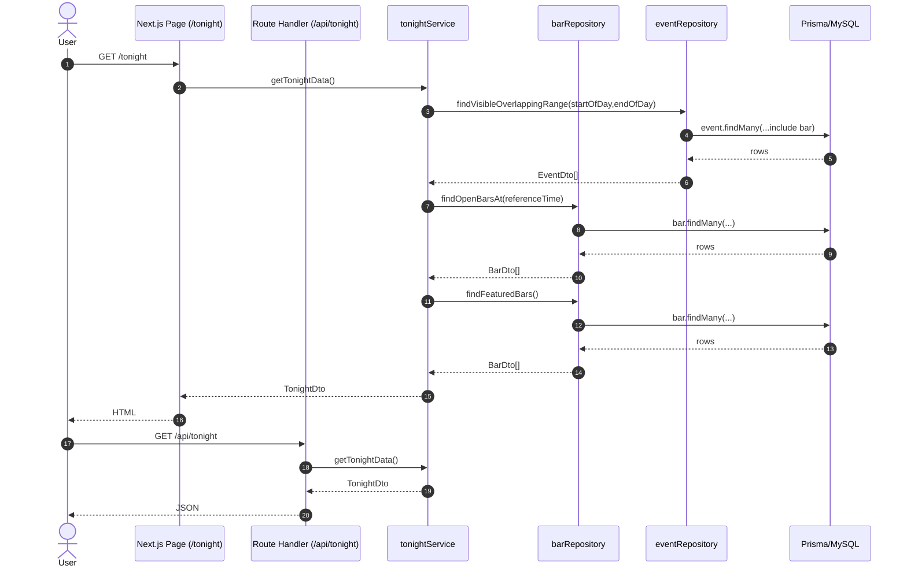

# UC010 — Sequence Diagram (SD)

```mermaid
sequenceDiagram
  autonumber
  actor User
  participant Page as Next.js Page (/tonight)
  participant API as Route Handler (/api/tonight)
  participant Service as tonightService
  participant BarRepo as barRepository
  participant EventRepo as eventRepository
  participant DB as Prisma/MySQL

  User->>Page: GET /tonight
  Page->>Service: getTonightData()
  Service->>EventRepo: findVisibleOverlappingRange(startOfDay,endOfDay)
  EventRepo->>DB: event.findMany(...include bar)
  DB-->>EventRepo: rows
  EventRepo-->>Service: EventDto[]
  Service->>BarRepo: findOpenBarsAt(referenceTime)
  BarRepo->>DB: bar.findMany(...)
  DB-->>BarRepo: rows
  BarRepo-->>Service: BarDto[]
  Service->>BarRepo: findFeaturedBars()
  BarRepo->>DB: bar.findMany(...)
  DB-->>BarRepo: rows
  BarRepo-->>Service: BarDto[]
  Service-->>Page: TonightDto
  Page-->>User: HTML

  User->>API: GET /api/tonight
  API->>Service: getTonightData()
  Service-->>API: TonightDto
  API-->>User: JSON
```
