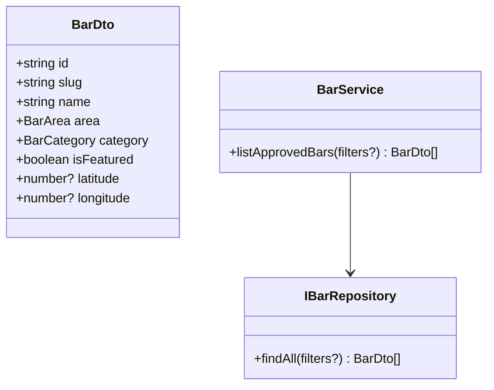

# UC011 — Design Class Diagram (DCD)

```mermaid
classDiagram
  class BarDto {
    +string id
    +string slug
    +string name
    +BarArea area
    +BarCategory category
    +boolean isFeatured
    +number? latitude
    +number? longitude
  }

  class IBarRepository {
    +findAll(filters?) BarDto[]
  }

  class BarService {
    +listApprovedBars(filters?) BarDto[]
  }

  BarService --> IBarRepository
```
