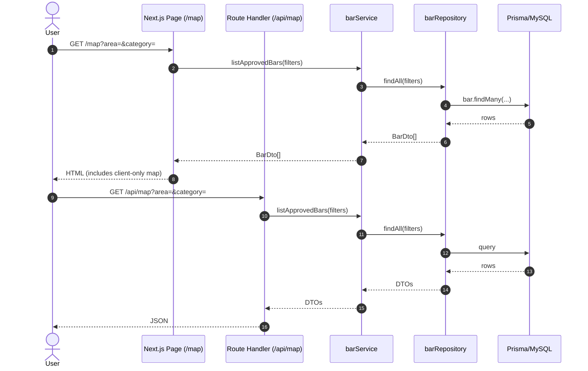

# UC011 — Sequence Diagram (SD)

```mermaid
sequenceDiagram
  autonumber
  actor User
  participant Page as Next.js Page (/map)
  participant API as Route Handler (/api/map)
  participant Service as barService
  participant Repo as barRepository
  participant DB as Prisma/MySQL

  User->>Page: GET /map?area=&category=
  Page->>Service: listApprovedBars(filters)
  Service->>Repo: findAll(filters)
  Repo->>DB: bar.findMany(...)
  DB-->>Repo: rows
  Repo-->>Service: BarDto[]
  Service-->>Page: BarDto[]
  Page-->>User: HTML (includes client-only map)

  User->>API: GET /api/map?area=&category=
  API->>Service: listApprovedBars(filters)
  Service->>Repo: findAll(filters)
  Repo->>DB: query
  DB-->>Repo: rows
  Repo-->>Service: DTOs
  Service-->>API: DTOs
  API-->>User: JSON
```
