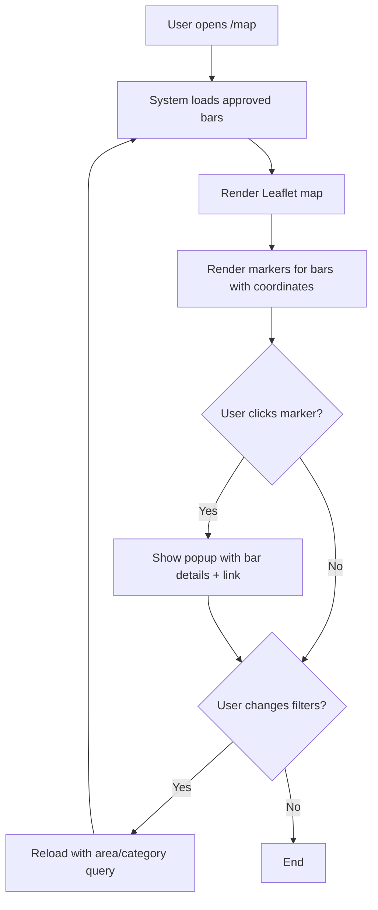

# UC011 — User Flow Diagram

```mermaid
flowchart TD
  A[User opens /map] --> B[System loads approved bars]
  B --> C[Render Leaflet map]
  C --> D[Render markers for bars with coordinates]
  D --> E{User clicks marker?}
  E -- Yes --> F[Show popup with bar details + link]
  E -- No --> G{User changes filters?}
  F --> G
  G -- Yes --> H[Reload with area/category query]
  H --> B
  G -- No --> I[End]
```
