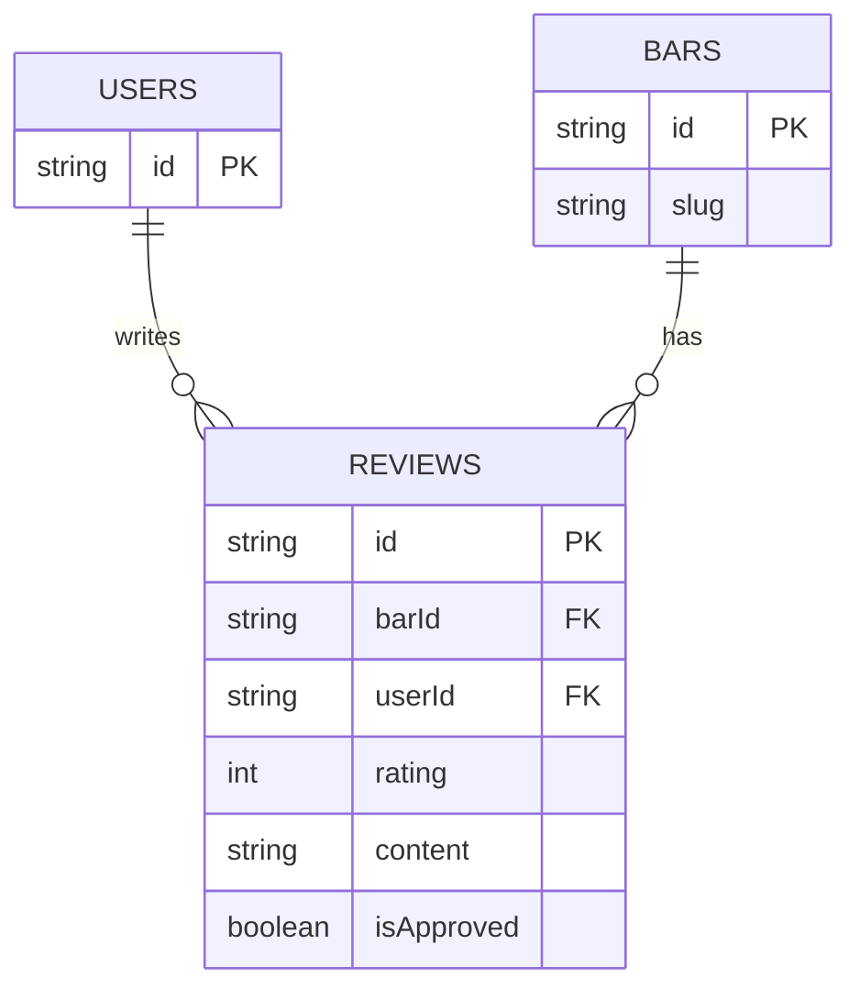

# UC012 — Entity Relationship Diagram (ERD)

```mermaid
erDiagram
  USERS ||--o{ REVIEWS : writes
  BARS ||--o{ REVIEWS : has

  USERS {
    string id PK
  }

  BARS {
    string id PK
    string slug
  }

  REVIEWS {
    string id PK
    string barId FK
    string userId FK
    int rating
    string content
    boolean isApproved
  }
```

Notes:

- Enforce one rating per user per bar via `@@unique([barId, userId])`.
