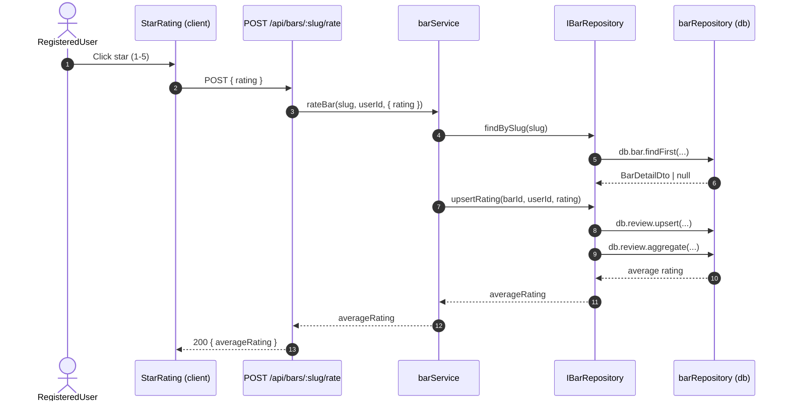

# UC012 — Sequence Diagram (SD)

```mermaid
sequenceDiagram
  autonumber
  actor RegisteredUser
  participant UI as StarRating (client)
  participant API as POST /api/bars/:slug/rate
  participant Service as barService
  participant Repo as IBarRepository
  participant Prisma as barRepository (db)

  RegisteredUser->>UI: Click star (1-5)
  UI->>API: POST { rating }
  API->>Service: rateBar(slug, userId, { rating })
  Service->>Repo: findBySlug(slug)
  Repo->>Prisma: db.bar.findFirst(...)
  Prisma-->>Repo: BarDetailDto | null
  Service->>Repo: upsertRating(barId, userId, rating)
  Repo->>Prisma: db.review.upsert(...)
  Repo->>Prisma: db.review.aggregate(...)
  Prisma-->>Repo: average rating
  Repo-->>Service: averageRating
  Service-->>API: averageRating
  API-->>UI: 200 { averageRating }
```
